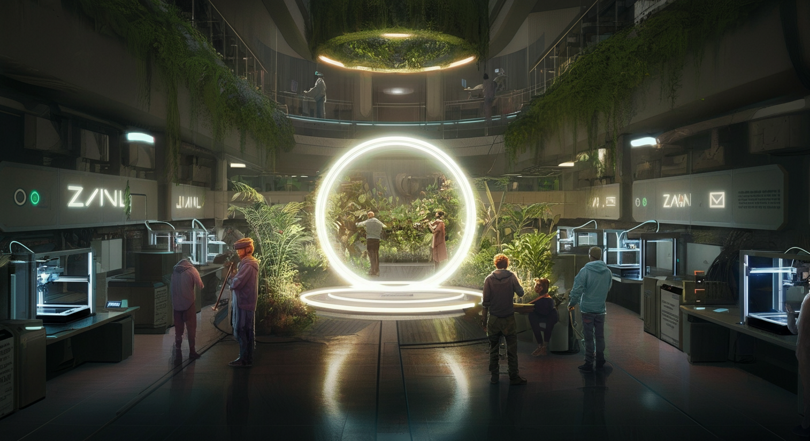

1. 

# 📜 Luma Event Report: Shaka (OSO) @ Frontier Tower

**Title:** Zuzalu to Frontier: Nomadic Roots & Vertical Villages  
**Tagline:** A Town Hall with Shaka (Open Source Orchestra) on the Zuzalu Movement & Cosmolocal Makerspaces.  
**Time:** Friday, Jan 30, 09:00 AM  
**Venue:** Mothership (Floor 2) / Frontier Makerspace (Floor 7), San Francisco  

---

### 🌊 Description
Join us at the Mothership for an intimate session with **Shaka**, the cultivator of **Open Source Orchestra (OSO)**, as he shares his journey through the Zuzalu movement and the evolution of collaborative co-creation.

Zuzalu was born as a pop-up mini-city experiment—a testing ground for network states and open technology. Shaka, through OSO, has been a key figure in this movement, fostering Ethereum-native music and art co-creation globally.

### 🔱 Objectives
- **Root Synchronization:** Connecting Frontier Tower to its Zuberlin/OSO origins, scaling the Zuzalu ethos into our permanent "vertical village."
- **Town Hall Blueprint:** Establishing the repeatable standard for **Make.DIY** and Frontier Tower Town Halls, bridging digital-first communities with physical fabrication.

### 🎥 What to Expect
- **The Zuzalu Trace:** Lessons from global Zuzalu gatherings and OSO's collaborative systems.
- **Cosmolocalism in Action:** Bridging the gap between global designs and local 7th-floor fabrication.
- **The Peace Circle Protocol:** A live PAPS (Peace Arch Portal System) demonstration for cross-chain telepresence.

### 🧭 Schedule
- **09:00 AM:** Coffee & Arrival
- **09:15 AM:** Shaka's Keynote: The OSO & Zuzalu Experience
- **09:45 AM:** Open Town Hall: Drafting the Blueprint
- **10:30 AM:** Peace Circle Closing

---
**Attribution:** Lachesis (20260125-031320@localhost)