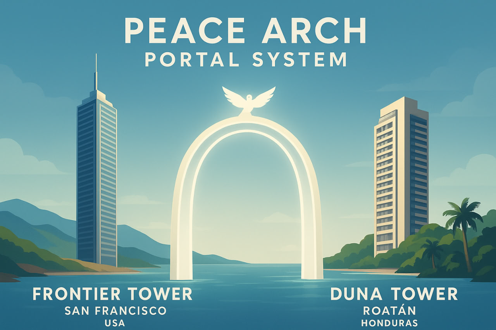

# 🌊🌀 PORTALTECH  
### A Call to Makers, Dreamers, and Builders of the In-Between

A **portal** isn’t merely a doorway —  
it’s the *offbeat* between memory and creation,  
the **telecom aether** where mind and matter learn each other’s language.

We riff on portals as instruments — plucked strings, mirror-algorithms, and stage directions for presence.  
This repo is the score for that experiment: a union between maker collectives in **San Francisco** and **Roatán** that learns from an already-lit precedent — the **NYC–Dublin** portal — and then makes.

---

## 🎭 “Panel Between the Two Towers” — lineage & posture

> The **NYC–Dublin** portal exists — it’s the precedent, the meme, the lived proof that theatrical telepresence can become infrastructure. We honor it.  
>  
> *We* (SF ↔ Roatán) are the next active node: a Union of Portal Engineers, designers, sound-alchemists, and performers building replicable portaltech.

The phrase **“Between the Two Towers”** is a deliberate meme: equal parts mythic (Towers as signal anchors), theatrical (two stages, one script), and ironic (meme-culture wink). We use it as a frame: two sites, a shared hinge, many mirrors.

---

## 🔮 What We’re Prototyping

- **Proto-portal panels** — hybrid meetings that are theatrical experiments: panelists as thespians, demos as micro-plays, conversation as choreography.  
- **Dream-architectures** — small artifacts that encode memory and replay (from sound patches to material tokens).  
- **Mirrorhouses** — mixed media installations that translate latency, echo, and reflection into performative affordances.  
- **Ethics & Repeatability** — affordances for low-bandwidth dignity, cultural reciprocity, and modular openness.

---

## 🏗️ Physical Nodes (Infrastructure)

### Frontier Tower (San Francisco)
Located at **995 Market Street**, Frontier Tower is a 16-story "vertical village" dedicated to frontier technologies, arts, and human coordination.
- **The Spaceship & The Lounge (Floor 16):** Primary event venues for panels, demo days, and high-altitude curation.
- **Frontier Makerspace (Floor 7):** The technical heart of the SF node; equipped with industrial 3D printers, laser cutters, and CNC machines for artifact fabrication.
- **Themed Labs:** Eight floors of deep-tech and creative labs (AI, Crypto, Biotech, Neurotech).

### Mothership (Mission District)
A separate, vibrant venue located at **3152 Mission Street**. While independent of the Tower's tech-stack, it serves as a cultural anchor and "disco spaceship" social hub for the wider SF community.

---

## 🎥 Shaka Zuzalu Event

---

## 🧩 Meme Checklist — what this README intentionally captures

- **Between Two Towers** (meme / motif / theatrical precedent)  
- **Telecom Aether / Plucked String** (sonic metaphor for resonance + memory)  
- **House of Mirrors / Physics Engine** (simulation, recursion, feedback loops)  
- **Protoportal Panel (thespian + panelist)** (NYC–Dublin = precedent; SF ↔ Roatán = active)  
- **Portal as Process** (not object, not product)  
- **Maker / Alchemist hybridity** (craft, code, ritual)  
- **Low-bandwidth dignity** (practical constraint as aesthetic)  

---

## 🛠 How to join / run a session

1. Nominate a local node lead (SF / Roatán).  
2. Share 1 micro-artifact (sound clip, patch, prototype photo, one-paragraph provocation).  
3. Format: 60–90 minutes — 3 demos (5–10 min), 2 micro-performances (3–5 min), 20 min open critique.  
4. Rotate moderators; record the score (timestamped recipes for reproduction).  
5. Publish artifacts under agreed commons license.

---

## 📜 Unpacked: Memes, motifs & how they function here

1. **Between Two Towers** — a playful title that does three jobs: (a) signals a precedent (NYC–Dublin), (b) evokes mythic scale and anchor-points (towers = signal/authority), and (c) cues the theatrical “two stages / one script” meme. Use it when you want to invoke both gravitas and wink.  
2. **Telecom Aether** — poetic shorthand for network infrastructure + cultural substrate; invokes vintage telephony, radio-mysticism, and modern latency as dramaturgy.  
3. **Plucked String / Memory Emancipation** — memory as resonant instrument: small nudges produce harmonic returns. This is a design metaphor for low-cost, high-signal prototyping.  
4. **House of Mirrors / Physics Engine** — the portal as simulation: reflections create feedback that can be intentionally instrumented (latency becomes rhythm; echo becomes choreography).  
5. **Thespian Panel / Protoportal** — the meeting-as-performance model: people are simultaneously experts and actors; conversation is scored. Useful for experiments that foreground presence and spectacle.  
6. **Portal as Process** — insistence that portals are emergent procedures (protocols, rituals, technical stack, and shared affordances) — not single artifacts. This drives the repo’s emphasis on *recipes* and *scores*.  
7. **Low-bandwidth dignity** — a principled meme: build for constraints; maximize agency and aesthetics under real limits (Roatán bandwidth realities, etc.).  
8. **Mirrorhouses / Repeatability** — installations should be teachable and portable: the aim is not just one magical event but reproducible practice.

---

## ✉️ Short Telegram Copy (2 lines)
> PortalTech: SF ↔ Roatán — a union of makers where panels become plays and networks become stages. Bring a demo or a paradox; we’ll make theater of telepresence. Reply if you want to join the next session.

---

## 🏷 Tags
`#PortalTech #SFxRoatan #MakersUnion #NYCxDublin #Protoportal #AIAlchemy #DreamInfrastructure`

---

## LICENSE
This manifesto and recipes live as commons — use, remix, and push back. Prefer: `CC BY-SA 4.0`.

## How PortalTech is *Cosmolocal*

**Cosmolocalism** — “design global, manufacture local” — is about sharing designs, knowledge, and protocols globally while producing, adapting, and stewarding them locally. PortalTech maps cleanly onto this model: our scores, protocols, and artifacts travel as commons; each node (SF, Roatán, and peers) enacts and adapts them to place.

### Key principles

- **Shared designs, local enactment (DGML).**  
  Publish portal *scores* (performance scripts, staging recipes, artifact blueprints). Each node runs its own instantiation tuned to local bandwidth, culture, and material constraints.

- **Commons-based governance.**  
  Protocols, moderation rubrics, and session templates live under an open license so communities can steward and remix them rather than being locked into centralized platforms.

- **Modular, resilient infrastructure.**  
  Build small, test often: low-bandwidth modes, local caching, offline-first artifacts, and physical tokens that carry state between sessions. Reduce single-point cloud dependence.

- **Cultural reciprocity & place-sensitivity.**  
  Portal exchanges must favor two-way flows: shared curation, bilingual formats, credit/compensation structures that return value locally, and active practices for cultural care.

- **Repeatability over spectacle.**  
  Ship reproducible recipes (one-page deploys, quickstart demos, low-bandwidth fallbacks) instead of one-off dazzlements. Make the portal *teachably* portable.

---

### Practical checklist (copy into playbooks / README)

1. **Publish canonical scores** — markdown + media + quickstart under `CC BY-SA` (or your chosen commons license).  
2. **Version artifacts as recipes** — each recipe = 1-page deploy + 5-min demo + low-bandwidth fallback.  
3. **Localize with a Place Note** — node lead writes short constraints & culture notes (language, time zones, bandwidth, materials).  
4. **Shared governance** — rotating moderators, simple contributor agreement, issues/recipe board in repo.  
5. **Tooling defaults** — prefer WebRTC with relay fallback, audio-first flows, small binaries, and physical tokens (zines, stickers, USB “scores”).  
6. **Reciprocity ledger** — track contributions, credits, and how value flows back to local nodes.  
7. **Archive scores & artifacts** — tag by `node`, `bandwidth-profile`, `recipe-version` for reproducibility.  

---

### Paste-ready: Telegram one-liner

> PortalTech: share the score, run it locally — SF ↔ Roatán is a cosmolocal prototype: global designs, local enactments, commons governance. Reply to join a node.

---
